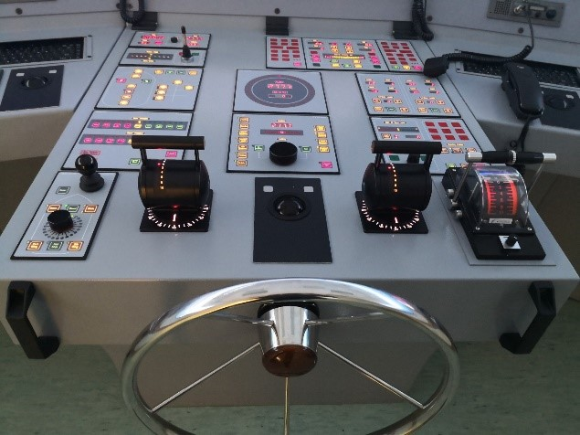
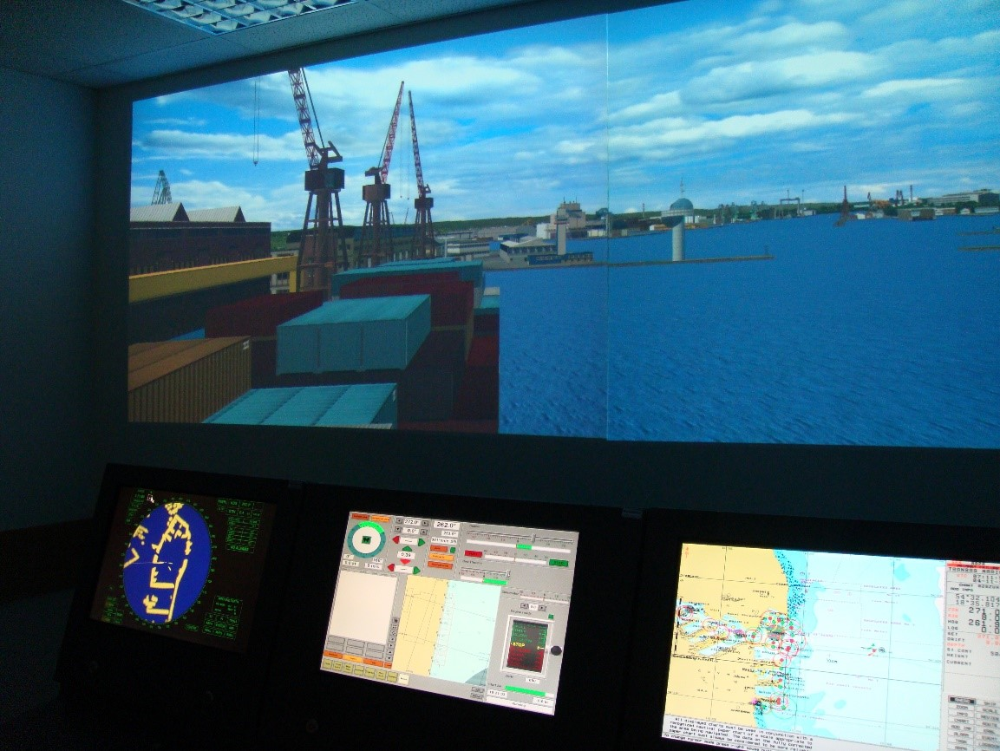
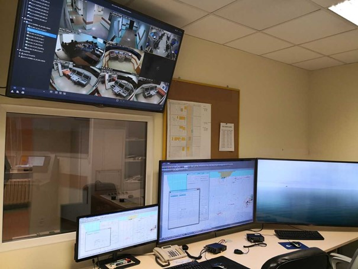
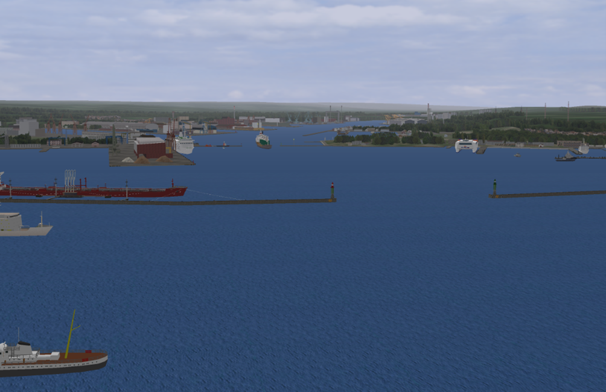

# MOSTEK NAWIGACYJNY

## Sprzęt fizyczny symulatora
Na pulpicie kontrolnym znajdują się:
*	moduł Radar z funkcją ARPA – Master Bridge E
*	moduł namiernika optycznego
*	konsola kontrolno-manewrowa z modułami rzeczywistymi: koła sterowego, telegrafu maszynowego, urządzenia sterowego, steru awaryjnego, sterów strumieniowych, autopilota, kontroli wizualizacji, windy kotwicznej, stanu pracy i alarmów systemu sterowania i napędu, świateł nawigacyjnych, repetytora kursu, dwa manipulatory pędników azymutalnych
*	moduł pulpitu kontrolno-manewrowego w wersji przełączanych ekranów komputerowych z dodatkową funkcją karty pilota, sygnalizacji, echosondy, żyrokompasu, logu, namiernika optycznego i operacji pokładowych
*	moduł odbiorników systemów nawigacyjnych: GPS (dGPS), Loran-C, radionamiernik
*	moduł elektronicznej mapy cyfrowej ECDIS – Navi Sailor 4100
*	monitoring wizyjny z możliwością rejestracji obrazu i dźwięku
*	moduł rozgłośni okrętowej i telefon.

## Stanowisko Instruktora
Stanowisko instruktora jest kluczowym elementem symulatora. Zapewnia instruktorowi, dzięki istniejącym urządzeniom i oprogramowaniu, pełną kontrolę nad wszystkimi systemami symulatora oraz tworzenie, modyfikację i odtwarzanie scenariuszy ćwiczeń. Instruktor ma do dyspozycji trzy 55 calowe monitory o rozdzielczości 3840 x 2160. Umożliwiają one prezentację modułu instruktora, kanału wizualizacji oraz podgląd oraz nasłuch na żywo sytuacji na poszczególnych mostkach nawigacyjnych poprzez monitoring wizyjny. 
Stanowisko wyposażone jest również w elementy systemu łączności wewnętrznej (telefon, symulator rozgłośni okrętowej) umożliwiające komunikację pomiędzy poszczególnymi stanowiskami symulatora. 

 
## Oprogramowanie Navi-Trainer Instructor 
#### Program służy do tworzenia scenariuszy ćwiczeń i jest zainstalowany na stanowisku instruktora, do którego podstawowych zadań należy:

*	tworzenie nowych i edycja już istniejących ćwiczeń (scenariuszy) w celu ich kolejnego wykorzystania;
*	selekcja dostępnych ćwiczeń i wygrywanie ich na stanowiska (mostki) treningowe oraz kontrolowanie ćwiczeń podczas ich przebiegu;
*	bieżąca ingerencja poprzez wprowadzanie zmian oraz kontrolę dowolnego obiektu znajdującego się w odtwarzanym scenariuszu; 
*	sprawdzanie i analizę rezultatów ćwiczeń po ich zakończeniu.

## Modele jednostek

##### W ramach posiadanej licencji, dostępnych jest 11 modeli jednostek, które można wprowadzić do scenariusza jako tzw. własne, sterowane przez ćwiczącego. W tej grupie wyróżnić można:
* szkolny statek rybacki (487) , 
* holownik (686), 
* prom pasażersko-samochodowy (20300), 
* serwisowiec OSV (5291), 
* zbiornikowiec LNG (109623), 
* kontenerowiec (191000), 
* statek rzeczno-morski (3510) 
##### cztery modeli okrętów: 
* fregata (3600), 
* okręt logistyczny (3210), 
* niszczyciel min (503), 
* okręt patrolowy (1706). 
* inne okręty załączone na obrazku ...

Model matematyczny wyszczególnionych jednostek posiada 6-stopni swobody i jest podatny na działanie sił zewnętrznych wywołanych wiatrem, prądem, falowaniem, działanie holownika, innej jednostki, nabrzeża, lin cumowniczych, kotwicy, wpływ płytkowodzia itp. Oddając w sposób bardzo realistyczny jej zachowanie w warunkach rzeczywistych. Do scenariusza można wprowadzić ponad 40 różnego typów jednostek celi, od jachtu po masowiec o wyporności 200 tys. ton, planując im trasę przejścia, z możliwością stałej jej korekty w czasie realizacji ćwiczenia. W środowisku symulatora prowadzenie samodzielnej nawigacji możliwe jest na siedmiu typach jednostek cywilnych oraz czterech jednostkach wojskowych. Każda z tych jednostek posiada własny model matematyczny, dzięki któremu w realistyczny sposób odwzorowane są jej zdolności manewrowe oraz skutki interakcji z nabrzeżem, dnem oraz kadłubem innej jednostki. 

## Akweny treningowe i warunki pogodowe

Oprogramowanie symulatora pozwala na korzystanie z dziewięciu akwenów treningowych, które zawierają porty o różnym stopniu uszczegółowienia. Najdokładniej odwzorowanymi portami są: 
* Approaches to Szczecin 
* Belt 
* Bosfor 
* Dover Strait 
* Gdansk Bay 
* Gibraltar Strait 
* Kieler Bucht 
* Oresund 
* Suez Canal 
* Open Sea 

Dostępne akweny są rzeczywistymi modelami powierzchni ziemi z elementami architektonicznymi i podwodną topografią.

Kształtowanie warunków pogodowych W tym zakresie istnieje możliwość symulowania różnych pór doby: świt, dzień, zmierzch, noc. Ważną zaletą programu jest łatwość wpływania na warunki hydrometeorologiczne, parametry: prądu, pływu, wiatru, stanu morza, zachmurzenia, widzialności, na całym akwenie treningowym (general condition) lub wybranej (wybranych) jego części (weather zone) z możliwością bieżącej ich zmiany lub zaprogramowania zmian dla wybranych momentów czasowych ćwiczenia.

## Scenariusze szkoleniowe

Zespół Okrętowych Symulatorów Nawigacyjno-Manewrowych daje możliwość prowadzenia ćwiczeń oraz zajęć laboratoryjnych w ramach szkoleń realizowanych przez Ośrodek Szkoleniowy AMW. Tematy zajęć możliwych do realizacji w formie ćwiczeń lub zajęć laboratoryjnych obejmują: 
* identyfikację optycznego oznakowania nawigacyjnego
* zapoznanie z locją wybranego akwenu
* określanie elementów manewrowych okrętów
* określanie poprawek urządzeń
* sterowanie okrętem z wykorzystaniem autopilota
* wykorzystanie poszczególnych funkcji systemu ECDIS
* wykorzystanie radionamiernika
* uruchamianie i obsługę odbiorników systemów radionawigacyjnych Loran-C, GPS i DGPS, NAVTEX, radionamiernik
* praktyczne przygotowanie i realizację meldunków w systemie VTS 
* doskonalenie procedur pełnienia wachty nawigacyjnej na statku na morzu w warunkach prostych, złożonych i awaryjnych
* manewrowanie pojedynczą jednostką w porcie i na redzie
* manewry taktyczne.

Dzięki przedstawionym rozwiązaniom technicznym i programowym symulator znajdujący się w AMW jest bardzo nowoczesnym narzędziem dydaktycznym i pozwala na prowadzenie treningu nawigacyjnego dla różnych poziomów odpowiedzialności. Symulator w szczególności pozwala na realizację ćwiczeń z zakresu:
* planowania i realizacji każdego etapu podróży morskiej w złożonych warunkach nawigacyjnych i hydrometeorologicznych (za wyjątkiem żeglugi w lodach)
* określania i szacowania dokładności pozycji z wykorzystaniem współczesnych metod pozycjonowania
* określania i uwzględniania poprawek podstawowych urządzeń nawigacyjnych (log, kompas żyroskopowy, magnetyczny i echosonda)
* określania elementów manewrowych jednostek
* wykorzystania radaru, ARPA, systemów ECDIS i GMDSS
* pełnienia wachty nawigacyjnej i przestrzegania procedur wachtowych
* manewrowania i kontroli okrętu w każdych warunkach
* manewrowania zespołem okrętów tzw. FLEET WORK
* manewrowania podczas zaopatrywania na morzu
* prowadzenia działań związanych z poszukiwaniem i ratowaniem.
